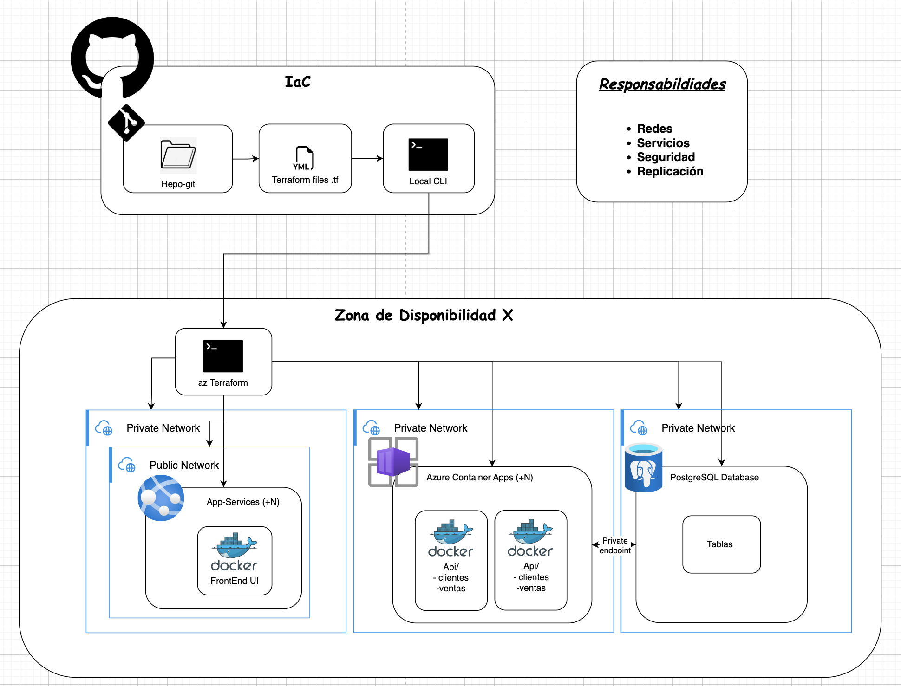

# Terraform para Infraestructura como Código (IaC)

[](https://terraform.io)
[](https://azure.microsoft.com)


## 🚀 ¿Qué es esto?
Este proyecto utiliza Infraestructura como Código (IaC) para gestionar y automatizar la configuración de infraestructura en Azure. La idea es mantener la infraestructura en archivos de configuración en lugar de configurar manualmente recursos.

## 🛠️ Prerrequisitos Para los repositorios asociados a este.
- Azure CLI instalado y configurado
- Terraform >= 1.5.0
- Suscripción a Azure con permisos apropiados
- Credenciales de Azure configuradas
- Github registry (imagen privada/publica de docker)

## 🛠️ Tecnologías Utilizadas
- [Terraform](https://terraform.io) (Para definición de infraestructura)
- [Azure CLI](https://docs.microsoft.com/cli/azure) (Para interacción con Azure)
- [Git](https://git-scm.com) (Control de versiones)
- Shell Scripts (Automatización)

## 🛠️ Arquitectura tipo


## 📦 Módulos de Infraestructura

Este repositorio contiene los siguientes módulos de Terraform:

- [IaC-azure-appservice](IaC-azure-appservice/) - Configuración de servicios web en Azure
- [IaC-azure-bd](IaC-azure-bd/) - Configuración de base de datos PostgreSQL en Azure
- [IaC-azure-blob-storage](IaC-azure-blob-storage/) - Configuración de almacenamiento Blob en Azure
- [IaC-azure-networks](IaC-azure-networks/) - Configuración de redes en Azure
- [IaC-azure-containerapp](IaC-azure-containerapp/) - Configuración de contenedores en Azure

## 📁 Archivos Necesarios
### 📝 Que deben crearse por el usuario:

1. **Variables de Entorno**
```bash
# .env
TF_VAR_subscription_id="your-subscription-id"
TF_VAR_tenant_id="your-tenant-id"
TF_VAR_client_id="your-client-id"
TF_VAR_client_secret="your-client-secret"
```
- estos .env se pueden descartar si el entorno de ejecución ya se ecuentra con una cuenta logeada en az con los permisos para realizar la creación de estos servicios.

2. **Archivos de Configuración  {terraform}.tfvars**
```
ghcr_username = "nombre usuarios"
ghcr_pat      = "token-git"  # con permisos de lectura de registri de github

```
- este por si se requiere para servicios con uso de docker utilizar una imagen privada (usar solo local no subir a git)

## 📁 Estructura del Proyecto

El proyecto está organizado en varios módulos de Terraform que implementan diferentes componentes de infraestructura en Azure:

```
IaC-document-terraform/
├── .git/
├── README.md
├── IaC-azure-appservice/
├── IaC-azure-bd/
├── IaC-azure-blob-storage/
├── IaC-azure-containerapp/
└── IaC-azure-networks/
```

Cada módulo está diseñado para implementar una parte específica de la infraestructura y puede ser utilizado de forma independiente o en conjunto con otros módulos.

## 📁 Implementación del Proyecto

El proyecto requiere de la siguiente orden de ejecucion para poder ser implementado
```
1. IaC-azure-blob-storage (y configuraciones posteriores)
2. IaC-azure-networks
3. IaC-azure-bd
4. IaC-azure-{containerapps/appservices} (indiferentes del orden)
```


## 🎯 ¿Por qué usarlo?
1. **Consistencia**: La infraestructura se mantiene igual en todos los entornos
2. **Versionamiento**: Cambios en la infraestructura se pueden rastrear
3. **Automatización**: Reducción de errores humanos
4. **Escalabilidad**: Fácil replicación de infraestructura
5. **Seguridad**: Gestión centralizada de credenciales
6. **Colaboración**: Trabajo en equipo más eficiente con estado compartido

## ☁️ Trabajo Colaborativo con Terraform
Este proyecto utiliza Azure Blob Storage como backend para Terraform, lo que permite:

1. **Estado compartido**: Todos los miembros del equipo acceden al mismo estado de Terraform
2. **Concurrencia**: Prevención de conflictos al trabajar simultáneamente
3. **Seguridad**: Credenciales almacenadas de forma segura en cada equipo

### Configuración del Backend
El módulo [IaC-azure-blob-storage](IaC-azure-blob-storage/) se utiliza para crear el almacenamiento Blob donde se guardará el estado de Terraform. Luego, los demás módulos se conectan a este backend a través del archivo `backend.tf` configurado en cada módulo.

### Configuración Local
Para configurar el backend en cada equipo, siga estos pasos:

1. Obtenga la clave de acceso al almacenamiento:
```bash
# Obtener la clave de acceso
az storage account keys list --resource-group "<nombre de recurso>" --account-name "<nombre de cuenta de blob-backend.tf>"
```
- esto se ejecuta en la terminal conectada a az
- eliminar ("") y (<>) / reemplazar con los valores respectivos para su uso particular (definidos en blob-backend)

2. Configure la variable en su archivo de configuración local (`.zshrc` o `.bashrc`):
```bash
# Agregar a ~/.zshrc o ~/.bashrc
echo 'export ARM_ACCESS_KEY="tu-clave-de-acceso"' >> ~/.zshrc
source ~/.zshrc
```

3. Verifique la configuración:
```bash
echo $ARM_ACCESS_KEY
```

**Nota**: Nunca suba las credenciales al repositorio git. Manténgalas en su archivo de configuración local.

---
**Nota**: Este README es una guía básica y debe adaptarse según las necesidades específicas del proyecto.
